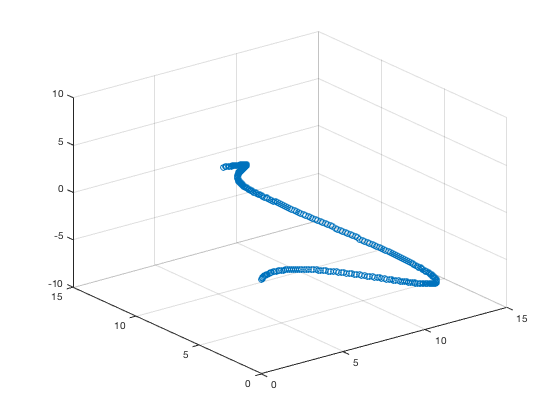

# CatmullRomSpline
A MATLAB function for generating a Catmull-Rom Spline from a set of control points

## Example Usage
This will generate a 2-dimensional Catmull-Rom spline and plot it:
```
C = catmullRomSpline([
    1   1;
    6   5;
    11  4;
    16  12;
    18  18
]);
scatter(C(:,1), C(:,2));
```
The plot will look like the following:


This will generate a 3-dimensional Catmull-Rom spline and plot it:
```
C = catmullRomSpline([
    -22 10   5;
    0   3   10;
    7   10   0;
    13  3   -8;
    0   0   0;
    0   -6   -20;
]);
scatter3(C(:,1), C(:,2), C(:,3));
```
The plot will look like the following:


